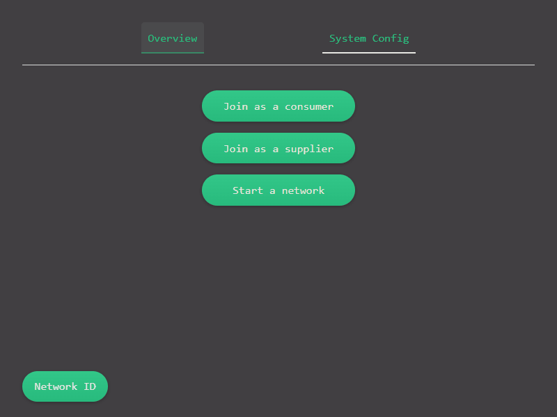
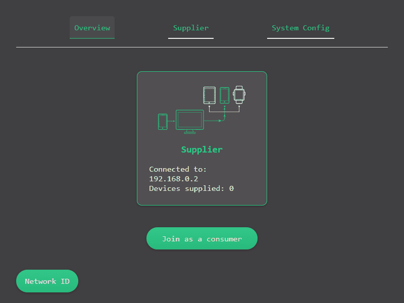
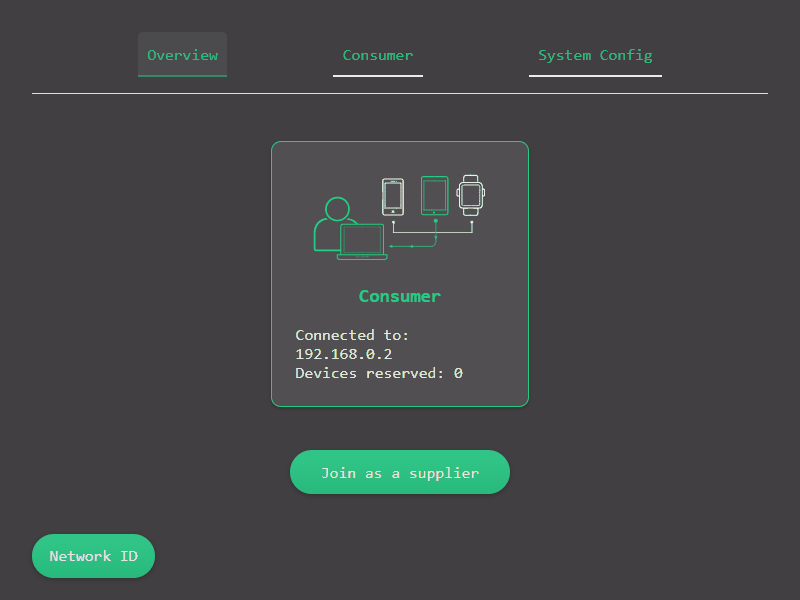
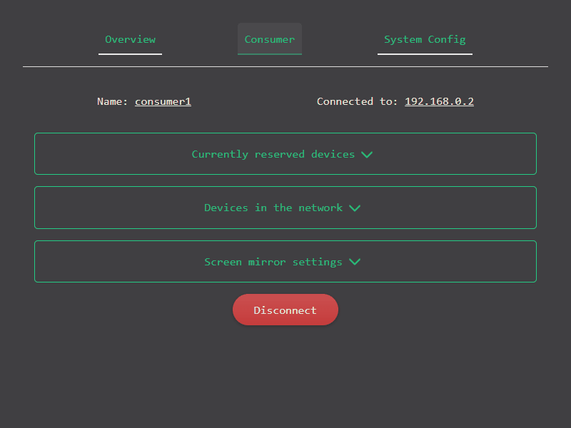
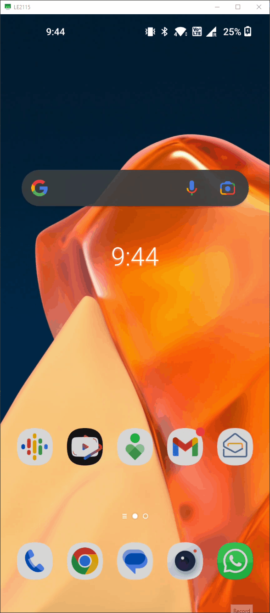

# Quick Start

## Start Network

Start the network by starting *MarketMaker* at the click of a button:

## Supply Devices

Join the created *network* as a *Supplier*. The network is identified by the hostname or IP address of the *MarketMaker*.
Click the checkbox for `Encrypt device communication` to start the Supplier in `secure` mode and enable encryption for all supplied devices:

Once the *Supplier* is connected to the network, click on the `Supplier` tab and navigate to the `Available System Devices` section.
It will list all the devices connected to the system. Supply devices individually by clicking on the `Supply` button next to the device or
supply all devices by clicking on the `Supply All` button:

## Use Devices

Join the created *network* as a *Consumer*. The network is identified by the hostname or IP address of the *MarketMaker*:

Once the *Consumer* is connected to the network, click on the `Consumer` tab and navigate to the `Available Devices` section.
It will list all the devices available in the network. Reserve devices individually by clicking on the `Reserve` button next to the device.

After the devices are reserved, you can use the devices transparently via `adb`. To mirror the device screen on your computer, on the `Consumer` tab,
navigate to the `Reserved Devices` section and click on the reserved device you wish to mirror. This will open the device details
screen where you can click on the `Mirror` button to mirror the device screen and control the device from your computer:

A new window will open with the device screen mirrored. Take a look at the [scrcpy](https://github.com/Genymobile/scrcpy) documentation
for more details on how to use the mirrored device:

